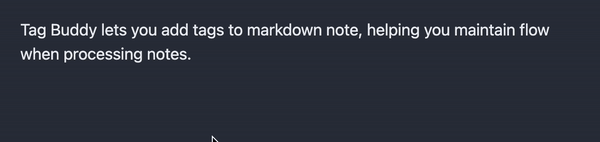
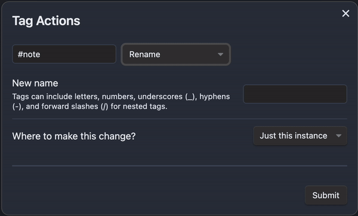
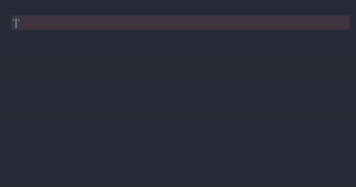
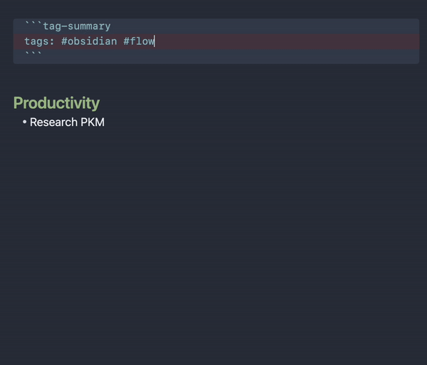
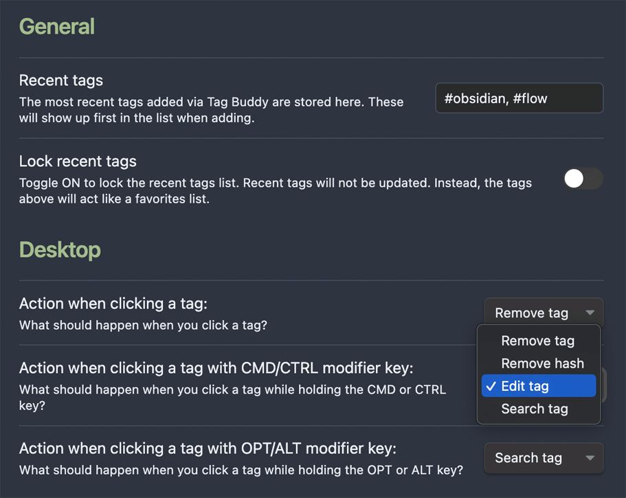
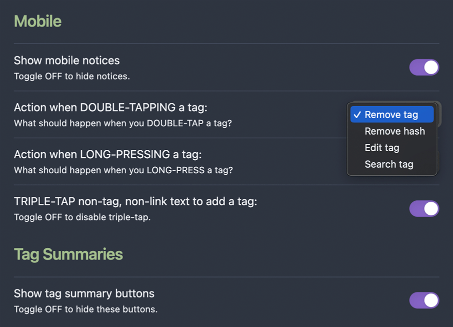
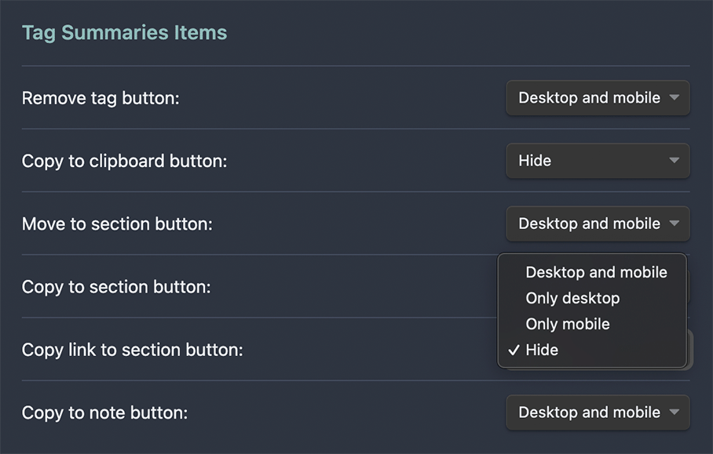

  <a href="https://www.buymeacoffee.com/moremeyou" target="_blank"></a>
# Obsidian Tag Buddy 🔖
Unlock powerful tag editing features in Reading Mode. Add, remove, and edit tags across your vault, in the active note or a single instance. Use tag summaries to roundup and process tagged content like an inbox. 

🔎 **Documentation below** ⬇️

🎬 **As seen in** *Capture and curate ideas: Modern note taking for creatives*

[](https://youtu.be/Q6_bC2aGKQk?si=eqwjhg-P5jW4lC4B)


### ✏️  Add tags to note
CMD+RIGHT-CLICK (or TRIPLE-TAP on mobile) displays a tag selector to chose a recent/favorite tag or create a new tag in any native markdown note, embedded content or tag summary (explained below).  



### 🧼 Remove tags and nested tags
By default, a CLICK (or DOUBLE-TAP on mobile) removes a tag. Nested tags will be removed from the deepest tag first. And you can customize these actions with modifier keys. For example: you can preserve native tag search when CLICKING and assign CMD+CLICK to remove the tag. More on settings below.


### 🫥  Edit tags individually, all in note or across the vault
By default, CMD+CLICK (or LONG-PRESS on mobile) on a tag reveals the Tag Action modal. From here you apply the following actions to just the clicked tag, all of the same tag in this note, or all of the same tag across the entire vault:
- Rename tag 
- Change case
- Convert to text
- Create tag summary




### 🔎 Generate and interact with tag summaries
Tag summaries can be auto-generated when editing a tag (as seen above) or with this basic syntax. Use the same interaction for adding, removing or editing tags within summaries or native embeds, just as you would elsewhere.



Interact with results in tag summaries:
- Copy paragraph to section in this note.
- Copy paragraph to section in another note.
- Move paragraph to section in this note. To achieve this, Tag Buddy first removes the queried tag from the paragraph, then copies it to the section.
- Section dropdown is explained below. 
- Remove tag button removes the tag but doesn’t copy the paragraph.

Interact with the entire summary with summary buttons:
- Reload the summary. Useful if you’re updating tags in queried notes.
- Copy to clipboard copies the entire summary as markdown.
- Copy the entire summary to another note.
- Flatten summary converts the dynamic summary to standard markdown (replacing the code block).

All these buttons can be hidden in the settings outlined below.

### 📚  Copy or move paragraphs to a section
As noted above, each paragraph includes a dropdown to specify where the move or copy buttons should paste the tagged paragraph. “Top of note” and “End of note” are always available. But if you include a header section title in the tag summary, this will also become an option in the dropdown, as seem below. If a section is chosen, when copying or moving to another note, Tag Buddy will look for that section to paste the content. If the section isn’t found, it will paste to the top of the note. In all cases, when pasting Tag Buddy will try to detect the list type below the section header.



### 🧩 Tag summary code block
This is the full syntax for all the parameters you can pass to the tag-summary code block. Using the include, exclude, and max parameters of the tag summary code block you can easily customise and build new notes from tagged content. 

````markdown
```tag-summary
tags: #tag1 #tag2 // Results can have either of these tags 
include: #tag3 #tag4 // Results must have both these tags (optional)
exclude: #tag5 #tag6 // But not have these tags (optional)
section: Productivity // Header sections (optional)
max: 3 // Limits the results in the summary (optional)
```
````
Thanks to [Tag Summary Plugin](https://github.com/macrojd/tag-summary) for the original code behind the summaries.

## ⚙️ Settings
Customize how Tag Buddy looks and functions across desktop and mobile.





## 🧐 Why is this useful to me? 
I use tags to connect ideas, but also as a flexible I/O or state/status management system. For example, most of my content comes in through daily notes with tags. Then I have specialized notes that query those tags into an "Inbox" section of the specialized note so I can review and process on-demand.  
###### Why only Reading Mode?
Tag Buddy is about maintaining your flow state when reading or reviewing your notes. Tag editing functionality in Reading Mode means you can, for example, remove “new” from “#book/highlight/new”, or quickly add “#todo” without switching to Edit or Source Mode.

## 👍 Support a buddy
There’s lots to do and I’d like this plugin to grow with Obsidian and the community. Your support will ensure on-going development and maintenance. 

<a href="https://www.buymeacoffee.com/moremeyou" target="_blank"></a>


## 📦 Install now
Obsidian approved December 6th, 2023! 🤘
- If you're already using community plugins, click here to install from the [Obsidian plugin store.](https://obsidian.md/plugins?id=tag-buddy)
- If you're new to Obsidian:
	1. Open Settings > Community Plugins
	2. Tap “Turn on Community Plugins” to access the store
	3. Search for **Tag Buddy**.
	4. Tap **Install**.
	5. After installation, tap **Enable**.
	6. Enjoy!


## ✅ To Do
- [x] ON-GOING: Refactoring and cleanup 👨🏻‍💻
- [ ] Add ‘exclude folder‘ parameter to summary code block
- [ ] Anchor link to tagged paragraph
- [x] ~~Edit tag modal “Just this instance”~~
- [x] ~~Mobile bugs with new settings~~
- [x] ~~Refactor settings~~
- [x] ~~BUG: Remove extra space if removing between words~~
- [x] ~~BUG: making new notes doesn’t work on mobile~~
- [x] ~~BUG: uncaught exceptions when using kanban and others~~
- [x] ~~BUG: Summaries aren’t showing tagged lists~~
- [x] ~~Ignore file paths that include, “_exclude”~~
- [x] ~~Better button/icons~~
- [x] ~~Summary improvements~~
	- [x] ~~Move to section is a dropdown of headers~~
	- [x] ~~Detect list type below heading~~
	- [x] ~~Add to section functionality checks for selected text~~
	- [x] ~~Add only link to section~~
	- [x] ~~Copy and move to section now buttons (not mod keys)~~
	- [x] ~~Show summary query tags and summary-level buttons in a configurable header~~
	- [x] ~~Place summary item links and item controls on the same line~~
	- [x] ~~Clean copied, flattened, and new-note summary output~~
	- [x] ~~Compact leading tag-only lines in summaries~~
- [x] ~~Edit tag text modal (options for this note, across vault)~~
	- [x] ~~rename~~
	- [x] ~~remove hash~~
	- [x] ~~lower case~~
	- [x] ~~make summary~~

## 👍 Support a buddy
There’s lots to do and I’d like this plugin to grow with Obsidian and the community. Your support will ensure on-going development and maintenance. 

<a href="https://www.buymeacoffee.com/moremeyou" target="_blank"></a>

## 🗒️ Notes
- Switch to editing to undo any edits in the active note. 
	- **Edits are permanent in embeds/summaries (unless that note is open in a tab). 
- **Known limitations:**    
	 - Editing tags within some other plugins or unknown view types is not supported, for now. Please reach out if you have a use case.
	 - Checkboxes are superficially functional in summaries. But the state change isn't applied to the source file. This functionality might be beyond the scope of this plugin.
	 - Two (or more) tag summaries or embeds in the same note referencing the same tags will lose sync with each other. Warnings have been implemented. WORKAROUND: Use the **Refresh button** below the tag summary to manually update. 
- - -

## Disclaimer
This plugin modifies your notes. And while there are multiple safety precautions, this plugin comes with no guarantee of any kind. Neither the author nor Obsidian are responsible for any loss of data or inconvenience. Use this plugin at your own risk. [See complete license here.](https://raw.githubusercontent.com/moremeyou/Obsidian-Tag-Buddy/main/LICENSE)
